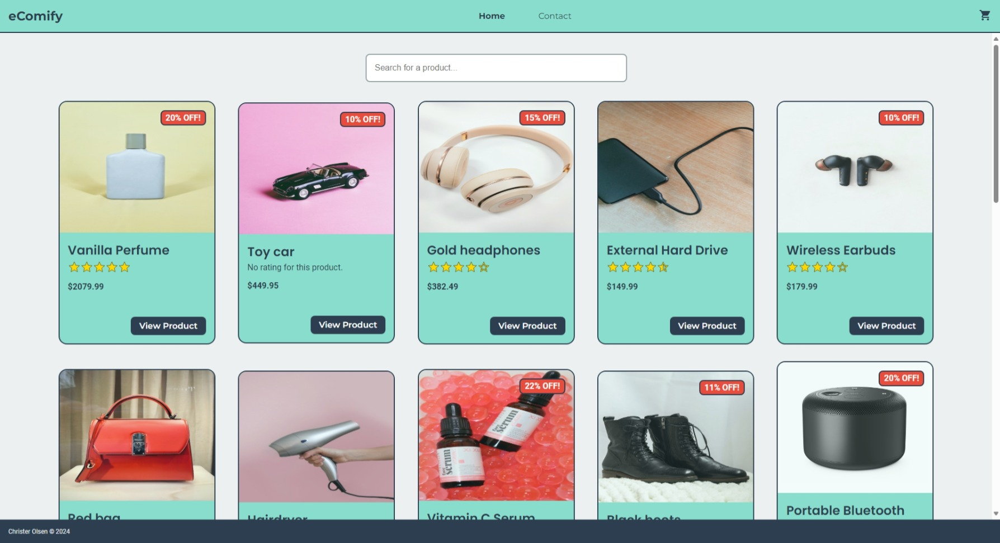

# eComify - JavaScript Frameworks CA @Noroff



To apply the Noroff student in the Front-end Development program knowledge React to build an eCom store.

## Description

eComify is a responsive e-commerce web application built with React and Vite. The app allows users to browse products, view detailed product information, manage a shopping cart, and complete a fictional purchase. The project leverages React Router for client-side routing, styled-components for styling, and integrates with an external API to fetch product data.

## Built With

- **[React + Vite](https://vite.dev/)**
- **[styled-components](https://styled-components.com/)**
- **[Material UI Icons (MUI)](https://fonts.google.com/icons)**

## Getting Started

### Installing

1. Clone the repo:

```bash
git clone https://github.com/christerolsen/front-end-frameworks-ca.git
```

2. Install the dependencies

```bash
npm install
```

3. Install Material UI Icons

```bash
npm install @mui/icons-material @mui/material @emotion/react @emotion/styled
```

#### Using Material UI Icons

1. Find the icon @ [Material UI Icons (MUI)](https://fonts.google.com/icons).
2. Import the icon by name and use it your component.

```bash
import IconName from "@mui/icons-material/IconName";

const ExampleComponent = () => {
    return (
        <>
            <IconName />
        </>
    )
}
```

### Running the Application

- To run the app, run the following command:

```bash
npm run dev
```

## Contact

- **[My LinkedIn page](https://www.linkedin.com/in/christer-olsen-b557ab1b4/)**

## Acknowledgments

This project is powered by **[Noroff API](https://docs.noroff.dev/)**
